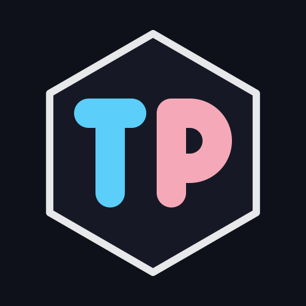

<div align="center">
  
  

# Trans Prism (TP) 🌈

**专为跨性别群体（Transgender）打造的极简、安全、双擎驱动的实用工具箱**

  <p>
    <a href="https://github.com/daanser/Trans-Prism/stargazers"></a>
    <a href="https://github.com/daanser/Trans-Prism/network/members"></a>
  </p>
  <p>
    <a href="https://flutter.dev/"></a>
    <a href="https://creativecommons.org/licenses/by-nc-sa/4.0/deed.zh"></a>
    <a href="http://makeapullrequest.com"></a>
  </p>

</div>

---

## 📖 关于项目 (About)

**Trans Prism (稳态光盒)** 是一款致力于为跨性别群体提供安全、客观、无审查的日常辅助工具的开源 App。

在信息获取日益困难、医疗资源分配不均的当下，TP 旨在成为一个“装在口袋里的庇护所”。它采用了独特的**在线/离线双擎架构**与**纯本地物理持久化**策略，确保你的核心知识库和极其隐私的生理数据不依赖于任何第三方服务器，永远牢牢掌握在自己手中。

---

## ✨ 核心功能 (Features)

### 📚 双擎动态知识库 (Dual-Engine Wiki)
* **无缝集成三大开源指南**：MtF.wiki, FtM.wiki, RLE.wiki。
* **默认轻量在线模式**：App 安装包极致精简（~15MB），默认采用零缓存直连加载，不占手机空间。
* **硬核 OTA 离线引擎**：支持按需一键下载离线包。通过监听 GitHub Releases API 触发静默热更新，将云端编译的 `.zip` 静态站点拉取至本地沙盒，实现断网环境下的完美秒开。
* **动态阅后即焚**：退出离线模式时提供可选的缓存清理机制，彻底告别数百 MB 的缓存爆炸，把空间选择权交还给用户。

### 💊 药物存量仪表盘 & 智能调度提醒
* **全景追踪**：追踪 HRT 药物库存存量与安全续航天数，提供直观的量化面板。
* **Chronos 智能调度引擎**：支持小时、天、周、月四种给药周期——从口服（12h）、外用凝胶到针剂（7天）、GnRHa（28天/84天）全覆盖。
* **绝对锚点系统**：基于绝对时间戳精准注册本地 OS 级别通知，即便长效药物也永不错过。
* **闭环推算**：点击“已服药”自动扣减库存、推算下一次给药时间并重设系统闹钟。数据采用纯本地 JSON 持久化，极致隐私。

### 📈 药代动力学 (PK) 模拟器
* 内置严谨的一室/多室指数衰减算法与多剂量叠加模型。
* 支持模拟常见 HRT 药物（如雌二醇、CPA、螺内酯代谢物等）的稳态血药浓度曲线。
* 帮助用户直观理解给药间隔、半衰期与体内浓度波动的数学关系。

### 🔄 跨旗色彩激素换算器
* 数据直接衍生自 [Next-MtF-wiki](https://github.com/project-trans/Next-MtF-wiki) (CC BY-NC-SA 4.0)。
* **6 项核心激素双向换算**：雌二醇（E2）、睾酮（T）、泌乳素（PRL）、孕酮（P4）、FSH、LH。
* 支持质量浓度与摩尔浓度的智能单位切换，自动过滤无逻辑的等价单位。
* **视觉指引系统**：参考范围卡片采用跨性别旗帜色彩（MtF 粉 / FtM 蓝 / NB 中性色）进行视觉映射，数值匹配时高亮弹起。

### 🎙️ 声音训练辅助
* 基于开源项目 [VFS Tracker](https://github.com/Ethanlita/vfs-tracker) 集成优化。
* 包含嗓音测试、音阶练习、88键钢琴、F0检测、主观量表与鼓励机制。
* 生成本地音频分析报告与训练记录时间线。

### 🏥 友善医疗名录
* 收录国内跨性别友善的内分泌科、精神科医生与就诊指南。

---

## 🏗️ 核心架构 (Architecture)

本项目除了 Flutter 客户端，还包含一套高度自动化的云端流水线：
* **Mono-repo CI/CD**：通过 GitHub Actions 每日定时监听上游 Wiki 仓库。
* **Python 语法清洗器**：自动拉取上游 Markdown 源码，拦截并洗稿 Hugo / VitePress 专属语法，重构为标准 MkDocs 格式。
* **无头构建与分发**：云端全自动编译 HTML 静态站点，压缩打包并发布至 Release，为客户端提供源源不断的热更新数据流。

---

## 🛠️ 本地构建与运行 (Build & Run)

本项目使用 [Flutter](https://flutter.dev) 框架构建，支持 Android / iOS 多端运行。

```bash
# 1. 克隆本仓库到本地
git clone [https://github.com/daanser/Trans-Prism.git](https://github.com/daanser/Trans-Prism.git)

# 2. 进入项目目录
cd Trans-Prism

# 3. 获取所有依赖包
flutter pub get

# 4. 在连接的设备或模拟器上运行
flutter run

# 5. 构建极速精简版 APK (推荐)
flutter build apk --split-per-abi --obfuscate --split-debug-info=./build/app/outputs/symbols

```

---

## ⚖️ 医疗免责声明 (Medical Disclaimer)

**⚠️ 极度重要：使用本软件前请务必仔细阅读此声明。**

1. **非医疗建议：** 本应用提供的所有功能、文本、图表及**尤其是“PK 血药浓度模拟器”得出的任何计算结果，均仅供学术交流与数据可视化参考。** 它**绝对不能**替代专业内分泌科医生的诊断、处方或临床医学检验。
2. **个体差异：** 药代动力学算法中的常量取自开源社区经验值与公开医学文献的平均水平。**每个人的肝肾代谢酶活性、体重、吸收率存在极其巨大的个体差异。** 模拟器画出的完美曲线，绝不代表您体内的真实浓度。
3. **责任豁免：** 本项目的开发者、贡献者不对用户依据本应用提供的数据进行的任何“自我药疗（DIY HRT）”行为及其产生的任何生理、心理后果承担任何形式的法律和医疗责任。
4. **遵医嘱：** 调整激素剂量是一项严肃的医疗行为，请务必在正规医生的指导下并结合实际的血液化验化验单进行。

---

## 🤝 开源与致谢 (Acknowledgments)

本项目秉承“属于社群，回馈社群”的开源精神。特别致谢以下组织与项目：

* 感谢 **[Project Trans](https://project-trans.org/)** 及其维护的 **MtF.wiki / FtM.wiki / RLE.wiki** 团队，为中文性别多元社群提供了极其宝贵的开源知识库。本项目的 Wiki 数据源及激素换算参考范围均离不开前人的卓越工作。
* 感谢 **[TransFeminine Science](https://transfemscience.org/)** 等开源社区前辈在药代动力学算法领域的卓越贡献，为 PK 核心引擎提供了坚实的数学基础。
* 感谢 **[VFS Tracker](https://github.com/Ethanlita/vfs-tracker)** 开源项目（CC BY-NC-SA 4.0），嗓音训练模块的音频分析流程参考自该项目。
* 感谢所有为跨性别生存与医疗权益发声的勇敢者。

---

## 📄 许可证 (License)

本项目采用 [CC BY-NC-SA 4.0](https://creativecommons.org/licenses/by-nc-sa/4.0/deed.zh)（署名-非商业性使用-相同方式共享 4.0 国际）协议开源。

你可以自由地共享、修改和分发本项目的代码与内容，但**绝对不允许用于任何商业盈利目的（禁止售卖）**，并且任何基于本项目的衍生作品都必须采用相同的开源协议发布。

---

*"May you find your steady state."*
