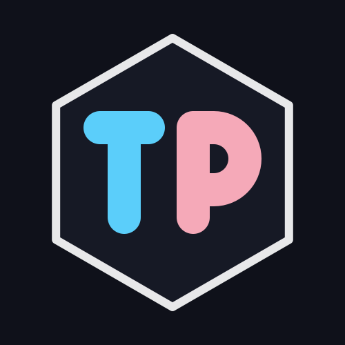

<div align="center">
  
  

# Trans Prism (TP) 🌈

**专为跨性别群体打造的极简、安全、双擎驱动的实用工具箱**

  <p>
    <a href="https://github.com/daanser/Trans-Prism/stargazers"></a>
    <a href="https://github.com/daanser/Trans-Prism/network/members"></a>
  </p>
  <p>
    <a href="https://flutter.dev/"></a>
    <a href="https://dart.dev/">=3.6.2 <4.0.0"></a>
    <a href="https://www.apache.org/licenses/LICENSE-2.0"></a>
    <a href="http://makeapullrequest.com"></a>
    <a href="https://github.com/Trans-Prism/Trans-Prism/releases"></a>
  </p>
  <p>
    <sub>当前版本 <b>v1.7.0</b></sub>
  </p>

</div>

---

## 📋 使用须知

**首次使用前请务必阅读：** [SECURITY.md](SECURITY.md) — 了解网络功能说明、血药浓度模拟的正确使用方式及免责声明。

---

## 📖 关于

**Trans Prism（稳态光盒）** 是一款致力于为跨性别群体提供安全、客观、无审查的日常辅助工具的开源 App。采用**在线/离线双擎架构**与**纯本地物理持久化**策略，核心知识库和极其隐私的生理数据不依赖任何第三方服务器。

> Created via Deepseek, Muse, GLM, Gemini, Claude, Mimo Vibe Coding

---

## ✨ 核心功能

### 🧭 首次启动向导 (Onboarding Wizard)
首次打开 App 时以「稳态光盒向导」引导新用户完成初始化：欢迎页 → 权限说明（声明公益 / 无广告 / 离线优先 / 不上传，再触发系统级通知权限申请，可拒绝继续）→ 性别认同 → 明暗模式（☀️ 折射白昼 / 🌙 吸收余光 / 🌓 随光流转）→ 主题风格（简约 / 毛玻璃）→ 称呼前缀与昵称 → 免责协议 → 「少女祈祷中…」装饰过渡 → 一切就绪。任意步骤点「跳过」即套用默认值（MtF + 跟随系统 + 简约风 + 无前缀 + 伙伴）并完成。老用户（已通过旧免责流程且已存性别认同）自动迁移、不再被打扰。所有偏好实时预览并写入 [`SharedPreferences`](lib/storage/gender_identity_repository.dart:6)，入口由 [`main.dart`](lib/main.dart:704) 的 `onboarding_completed` 标志位单分支判定。

### 💊 药物存量仪表盘 & 智能调度提醒
追踪 HRT 药物库存与安全续航天数。**Chronos 智能调度引擎**支持小时/天/周/月四种给药周期——从口服（12h）、外用凝胶到针剂（7天）、GnRHa（28天/84天）全覆盖。基于绝对时间戳的 OS 级通知，点击"已服药"自动扣减库存、推算下次给药时间并重设系统闹钟。

### 🪟 桌面用药小组件（v1.7.0 新增）
Android 主屏可选两种尺寸：**3×4 一览**（今日进度 + 三行药 + 近 7 天打卡）与 **2×2 下一剂**（环形倒计时 + 一键进入）。深浅色跟随 App 内「我的 → 主题模式」的偏好（**不跟壁纸、不跟系统**，除非 App 设为跟随系统）。

> **小组件永不写入数据**：点任意一行 / 点环 / 点按钮都只是唤起 App 并拉起该药的「记录用药」Sheet，**只有点「确认服药」才会记一笔**。取消或返回不改动任何数据——这是为防口袋误触刻意设的约束。入口：「我的 → 外观与显示 → 添加到主屏幕」。

> **点击打不开 App？** Android 10+ 会限制应用「从后台启动界面」，而小组件点击正属于这种操作。请到「我的 → 高级 → 通知权限与保活」开启**「显示在其他应用上层」**（该权限在系统的后台启动豁免名单内）。同一页底部的**「小组件点击自检」**会实时显示卡片最近渲染时间与被拉起次数，排查时无需抓日志。

### 💰 用药成本 & 记录导出
补货时可选填**自定义规格 + 价格**（如 `30 元 / 28mg`、`1000 元 / 1针`，也支持按单价录入），据此推算**平均单次使用费用**。价格**可填可不填**——留空只加库存、**不计入统计**（不是按 0 元算），已填价格的药物按**加权平均**计算。

口径说明：App 内的剂量与库存是**无单位的纯数字**，因此成本锚定在**「够用次数」**上：`单次使用费用（平均）= Σ本次花费 / Σ够用次数`。按次数加权让**总额天然自洽**，所以**打卡流程不需要任何额外输入**。遇到陌生单位（如「针」）可在补货时就地记一次换算（`1 针 = 5 mg`），之后自动折算。

展示位置：药物卡片的「单次花费 ｜ 月」、仪表盘汇总卡的月预计与库存估值、首页存量摘要的月花费、以及独立的**用药成本明细页**（含累计支出趋势）。币种默认 `CNY`，可在「我的 → 成本币种」更换（**仅更换符号，不做汇率换算**）。

**导出记录 PNG**：药物存量仪表盘右上角进入，支持 **仅记录 / 仅价格 / 价格+记录** 三种模式，每种都可选择**是否打码**（打码后药名显示为「药物 A/B/C」，并隐藏剂量、注射部位与备注，**保留金额**）。导出图为本地生成，含 App logo 与名称；记录较多时**自动分成多张图片**。

### 📈 药代动力学 (PK) 模拟器
基于开源项目 [Oyama-s-HRT-Recorder](https://github.com/SmirnovaOyama/Oyama-s-HRT-Tracker) 的一室/多室指数衰减算法与多剂量叠加模型。支持模拟常见 HRT 药物的稳态血药浓度曲线。App 内嵌 WebView 运行，算法在 WebView 内的 JS 中（非 Dart 侧）。

### 📚 双擎动态知识库
无缝集成 **MtF.wiki / FtM.wiki / RLE.wiki / MioMtFWiki** 四大开源指南。默认轻量在线模式（零缓存），支持一键下载离线包（OTA 静默热更新），退出离线模式时可选清理缓存（"阅后即焚"）。

### 🔄 激素换算器
6 项核心激素（E2/T/PRL/P4/FSH/LH）质量浓度 ↔ 摩尔浓度双向换算，数据衍生自 MtF.wiki。

### 🏥 友善医疗名录
收录国内跨性别友善的内分泌科、精神科医生与就诊指南，支持筛选、收藏、自动同步更新。

### 📏 罩杯计算器 & 发育记录追踪
基于 MtF.wiki 大陆标准算法（胸围差 10cm=A，每 2.5cm 递进），5 项测量输入，自动计算 CN/US/EU 三地尺码。每次计算结果自动保存为发育记录，支持历史趋势回溯。所有数据纯本地持久化，绝不离开设备。
      |
### 🎨 SVG 图解资源库
跨性别主题 SVG 图标库（Noto/OpenMoji/Twemoji 三种风格），支持导出 PNG/JPEG/WEBP、分享、存相册。

### 🪟 双风格主题系统
内置 **简约风** 与 **毛玻璃** 两套可切换主题（「我的 → 主题风格」），选择持久化于本地。毛玻璃风格基于 [`liquid_glass_easy`](https://pub.dev/packages/liquid_glass_easy) 渲染包 + Impeller 后端实现 Snell 折射、光学边框与色散边缘；简约风为实色 + 软弥散阴影。组件库「双模自适应」——`GlassCard`/`GlassSurface`/`GlassSheet`/`GlassAppBar`/`LiquidGlassNav` 等在两风格间无缝切换，业务页调用点改动极小。激素换算器与罩杯计算器采用「页面级双风格分离」以追求像素级统一。支持无障碍降级（实心化）与暗色模式。

---

## ⚠️ 已知限制

### 🔴 数据备份需分两步操作

由于血药浓度模拟（PK）基于内嵌 WebView 运行的 [Oyama HRT Tracker](https://github.com/SmirnovaOyama/Oyama-s-HRT-Tracker) SPA，其数据存储在 WebView 的 `localStorage` 中（绑定到 `localhost:{port}` origin，默认端口 53140、可配置，见 [ADR-006](ARCHITECTURE_DECISIONS.md)），与主应用的 `SharedPreferences` 数据相互隔离。当前**统一备份功能无法可靠地导出 PK 模拟数据**——跨 Dart/JS 边界提取 `localStorage` 的机制存在竞态与脆弱性。

**当前操作方式（需分两步）**：

| 步骤 | 操作路径 | 导出内容 |
|------|---------|---------|
| 1️⃣ 导出主应用数据 | 我的 → 数据导出与恢复 → 导出数据 | 药物记录、医疗名录收藏、罩杯发育记录等 SharedPreferences 数据 |
| 2️⃣ 导出 PK 模拟数据 | 血药浓度模拟页面 → SPA 内部设置菜单 → 导出 | 血药浓度事件、化验结果、体重等 Oyama localStorage 数据 |

**导入同样需要分别操作**：先导入主应用备份 JSON，再在 PK 模拟页面内导入 Oyama 备份。

> 📋 此问题已列为待修复项，技术分析与修复方案详见 [`TODO.md`](TODO.md) 与 [`docs/DATA_EXPORT_COMPATIBILITY.md`](docs/DATA_EXPORT_COMPATIBILITY.md)。

### 💰 用药成本的口径前提

「用药成本」不是逐次精确记账，而是**按平均单价估算**。三条前提需要知道：

1. **锚点是「够用次数」，不是任何度量单位**。App 内的「每次剂量 / 当前库存」都是**无单位的纯数字**，所以成本统计不依赖 mg/片/针：`单次使用费用（平均）= Σ本次花费 ÷ Σ够用次数`。按次数加权让**总额天然自洽**（先 `¥30/14次` 再 `¥40/14次` → 均价 `¥2.50/次`，28 次 × 2.50 = **¥70 = 真实总支出**），因此**打卡流程不需要任何额外输入**。
2. **补货时的规格换算需你自己确认一次**。若买的是「针 / 片」而剂量按 mg 记，补货面板会就地问一次 `1 针 = 5 mg`（可勾选记住）；也可点 ⚡ 按剂量折算或直接手改「这份够用几次」。**程序不会替你猜**，但会把推导过程实时显示出来，错值当场可见。
3. **币种只换符号，不做汇率换算**（默认 `CNY`，可在「我的 → 成本币种」更换）。切换币种**不会**改动已记录的历史数字。

> 另外：**未设价格的药物不计入任何合计**（不是按 0 元算），汇总处会显式标注「不含未设价格的 N 种」。`0 元`（赠药）是**合法价格**，与「未填」严格区分。

---

## 🚀 快速使用

### Android
直接前往 [Releases 页面](https://github.com/Trans-Prism/Trans-Prism/releases) 下载最新 APK 安装。

### Windows / Linux / Web
```bash
git clone https://github.com/Trans-Prism/Trans-Prism.git
cd Trans-Prism
flutter pub get
flutter build windows   # Windows
flutter build linux     # Linux
flutter build web       # Web
flutter build ios       # iOS（需自行签名）
flutter build macos     # macOS（需自行签名）
```
> ⚠️ 因成本问题暂不提供开发者签名，iOS/macOS 需自行自签名。

> **⚠️ 注意事项：** Windows / Linux / Web / iOS / macOS 平台因环境所限均未经过完整测试，可能存在 Bug。

### 鸿蒙 OS
暂无开发计划。可尝试使用「卓易通」等兼容层运行 Android APK。

---

## 🏗️ 架构速览

```
Trans_Prism (Flutter App) ←── Cloudflare R2 ──→ Builder 内容工厂（VitePress）
     │                                               │
     │ 主要功能模块                                  │ 清洗 4 个 Wiki 上游 + 2 个 Tracker
     │ 纯本地存储 (SharedPreferences)                 │ vitepress build → 打包期做离线相对化
     │ 三路 OTA: APK / Wiki / Tracker                 │ 封包 ZIP → GitHub Release → R2
     │  Wiki / Tracker 走 `vp-builder/` 通道          │  (旧 MkDocs 链保留在 `builder/` 前缀)
```

> 知识库构建链已于 v1.6.5 从 **MkDocs Material** 迁移到 **VitePress**（`vp-builder/` 通道，套用 [`@project-trans/vitepress-theme-project-trans`](https://github.com/project-trans/vitepress-theme-project-trans)）；两条链在 R2 上路径隔离，可随时回退。详见 [ADR-004](ARCHITECTURE_DECISIONS.md)。

详细架构决策参见 [`ARCHITECTURE_DECISIONS.md`](ARCHITECTURE_DECISIONS.md)，生态全貌参见 [`SYSTEM_MAP.md`](SYSTEM_MAP.md)。

---

## 🛠️ 技术栈

| 维度 | 方案 |
|------|------|
| 框架 | Flutter 3.27+ / Dart `>=3.6.2 <4.0.0` |
| 状态管理 | 原生 `StatefulWidget` + `setState`（仅主题一处 ChangeNotifier） |
| 本地存储 | `SharedPreferences`（JSON Key-Value）+ 文件系统（离线包） |
| 网络 | `dio` + `http` + 自研 DoH 抗污染 |
| 路由 | 命令式 `Navigator.push`（无 go_router） |
| WebView | `webview_flutter` |
| 通知 | `flutter_local_notifications` + `timezone` |
| 更新分发 | Cloudflare R2 边缘节点 `downloads.chengxi.moe` |
| 离线内容 | Builder 产出 **VitePress** 站点 ZIP（R2 `vp-builder/` 通道），App 侧 `shelf` 本地服务器与 `file://` 双兼容加载 |
| 本地服务器 | `shelf`（PK 模拟器内嵌 HttpServer） |
| 主题 | 双风格（简约风 + 毛玻璃）+ `liquid_glass_easy` 渲染包 + Impeller；`GlassTheme`（InheritedWidget）+ `GlassTokens` |

---

## 📄 License & 版权声明

本项目采用**代码、算法与内容分离**的复合授权模式：

1. **原创客户端代码** — [Apache License 2.0](https://www.apache.org/licenses/LICENSE-2.0)
2. **PK 计算引擎**（衍生自 Oyama）— [MIT License](https://opensource.org/licenses/MIT)
3. **内置知识库文本**（独立模块）— [CC BY-SA 4.0](https://creativecommons.org/licenses/by-sa/4.0/deed.zh) / [CC BY-ND 4.0](https://creativecommons.org/licenses/by-nd/4.0/)
4. **知识库主题** — [@project-trans/vitepress-theme-project-trans](https://github.com/project-trans/vitepress-theme-project-trans)（[MIT](https://opensource.org/licenses/MIT)）

> 激素换算与罩杯计算使用的是公开的通用换算与测量方法，不适用第三方内容许可。

> Trans Prism is open-source software licensed under Apache License 2.0.
> The Trans Prism name, logo, and other branding are not licensed under Apache License 2.0.

---

## 👨‍💻 开发者参考

| 想做什么 | 先去哪个文件 |
|----------|-------------|
| 改首次启动向导 | [`onboarding_wizard.dart`](lib/screens/onboarding/onboarding_wizard.dart:38) / [`main.dart`](lib/main.dart:704)（`AppRootController` 三态判定 + 迁移分支）|
| 改用药/提醒 | [`medication_service.dart`](lib/services/medication_service.dart:25) / [`notification_service.dart`](lib/services/notification_service.dart:14) |
| 改用药成本 / 价格 | [`medication_cost_service.dart`](lib/services/medication_cost_service.dart:130)（**纯函数**：加权均价、够用次数折算）/ [`restock_sheet.dart`](lib/widgets/restock_sheet.dart:31)（补货录入口）/ [`inventory_dashboard_screen.dart`](lib/screens/inventory_dashboard_screen.dart:672)（药物表单 `_DrugFormPage`，含首次购入价格）/ [`medication_report_view.dart`](lib/widgets/medication_report_view.dart:44) + [`medication_report_renderer.dart`](lib/services/medication_report_renderer.dart:44)（导出长图与分片）|
| 改 PK 模拟 | [`tracker_screen.dart`](lib/screens/tracker_screen.dart:189)（⚠️ 算法在 WebView JS 中，非 Dart）|
| 改 Wiki 知识库 | [`wiki_sync_service.dart`](lib/services/wiki_sync_service.dart:37) / [`wiki_update_manager.dart`](lib/services/wiki_update_manager.dart:31) |
| 改医疗名录 | [`medical_directory_service.dart`](lib/services/medical_directory_service.dart:22) |
| 改激素换算 | [`hormone_converter_logic.dart`](lib/utils/hormone_converter_logic.dart:1)（纯函数）|
| 改罩杯计算 | [`bra_calculator.dart`](lib/services/bra_calculator.dart:1)（纯函数）/ [`bra_calculator_page.dart`](lib/screens/bra_calculator_page.dart:14)（UI，双风格分离）|
| 改主题/玻璃组件 | [`theme_service.dart`](lib/services/theme_service.dart:7) / [`glass_tokens.dart`](lib/theme/glass_tokens.dart:18) / [`glass_theme.dart`](lib/theme/glass_theme.dart:13) / [`glass_surface.dart`](lib/widgets/glass_surface.dart:27) |
| 改更新逻辑 | [`update_service.dart`](lib/services/update_service.dart:52) |
| 了解全貌 | [`REPO_MAP.md`](REPO_MAP.md)（AI Agent 导航）|

---

## 🤝 致谢

感谢 [Project Trans](https://project-trans.org/)（MtF/FtM/RLE Wiki）、[MioMtFWiki](https://github.com/KitsuMio/MioMtFWiki)、[Oyama-s-HRT-Recorder](https://github.com/SmirnovaOyama/Oyama-s-HRT-Tracker) 及 [HRT-Recorder-online](https://github.com/LaoZhong-Mihari/HRT-Recorder-online) 等开源项目与社区。

---

> **⚠️ 医疗免责声明：** 本 App 所有功能仅供学术交流与数据可视化参考，**不能替代专业医生的诊断与处方**。调整激素剂量请务必在正规医生指导下进行。

---

## Star History

<a href="https://www.star-history.com/?type=date&repos=Trans-Prism%2FTrans-Prism">
 <picture>
   <source media="(prefers-color-scheme: dark)" srcset="https://api.star-history.com/chart?repos=Trans-Prism/Trans-Prism&type=date&theme=dark&legend=top-left&sealed_token=Rac_fHrj8ACOWMqtsdR8LJdWDQTj36Zy7oql6OuWtVO84yJViDVTVTNwYdLxnF46HhM0oNseO49w8NHVh1krGhZAv_Y1Ay4sW-oU8vFX_7zdc5cUvQ0IDAvkBhGNCGKlOpmm09HpVB2O92_CCDJNezVI-ZwJ8acrUOxQ9nnPXSxBHGy2qoV1rhAEGl5U" />
   <source media="(prefers-color-scheme: light)" srcset="https://api.star-history.com/chart?repos=Trans-Prism/Trans-Prism&type=date&legend=top-left&sealed_token=Rac_fHrj8ACOWMqtsdR8LJdWDQTj36Zy7oql6OuWtVO84yJViDVTVTNwYdLxnF46HhM0oNseO49w8NHVh1krGhZAv_Y1Ay4sW-oU8vFX_7zdc5cUvQ0IDAvkBhGNCGKlOpmm09HpVB2O92_CCDJNezVI-ZwJ8acrUOxQ9nnPXSxBHGy2qoV1rhAEGl5U" />
   
 </picture>
</a>

*"May you find your steady state."*
